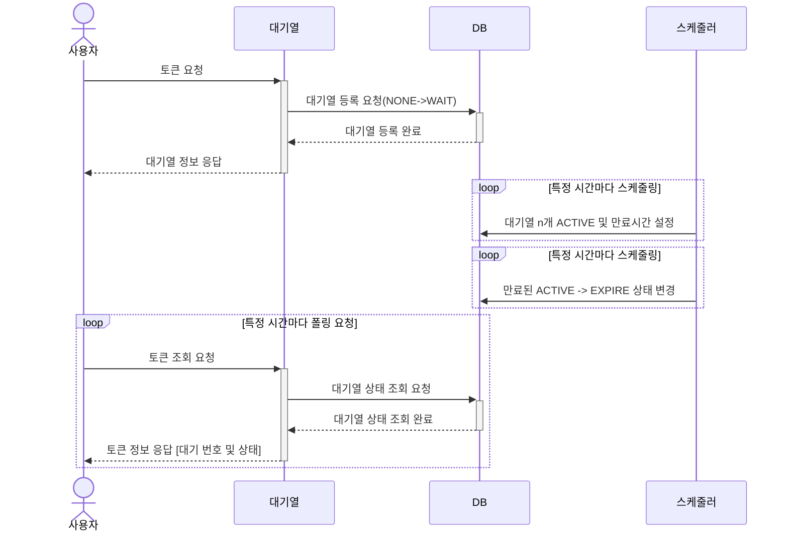
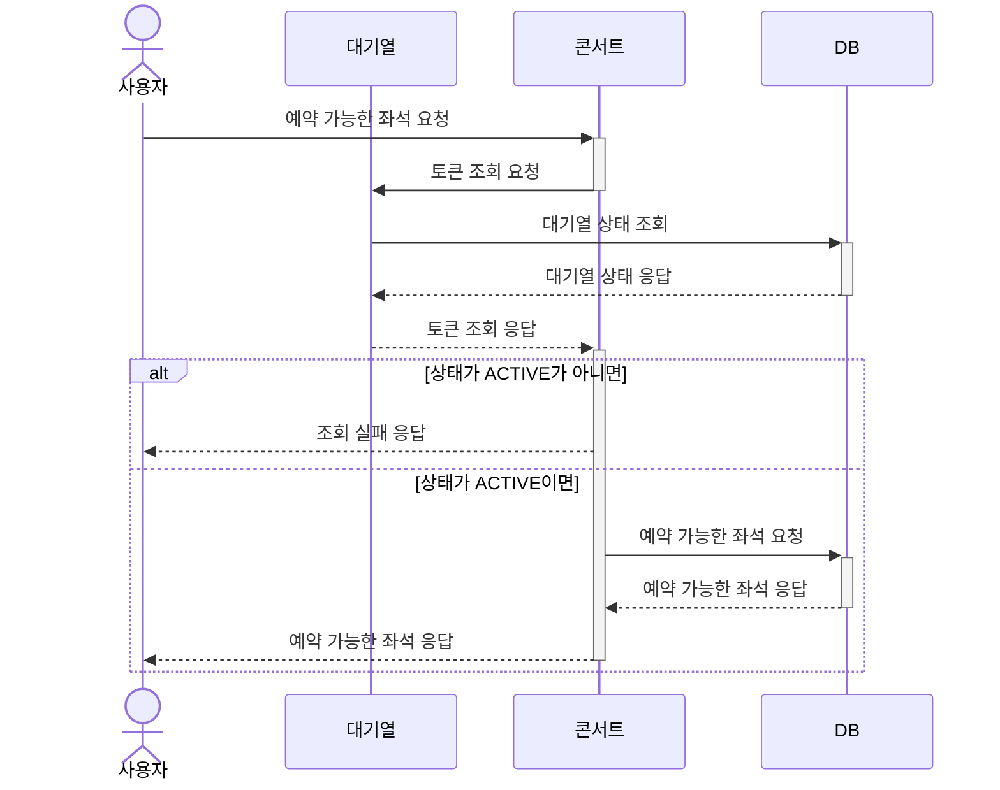
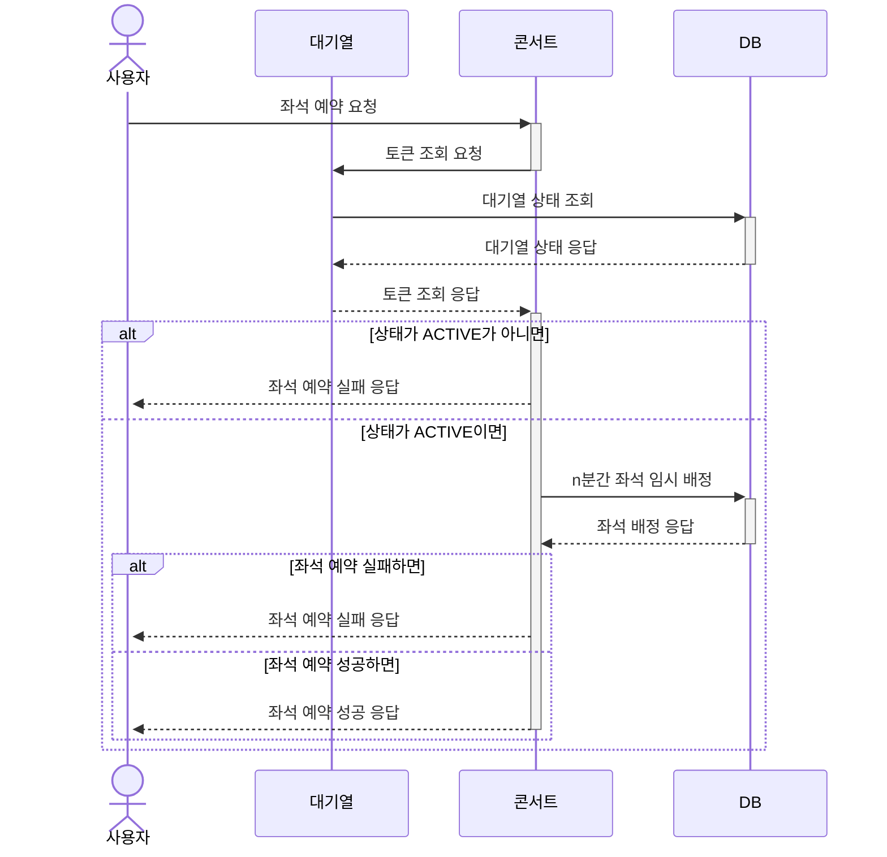
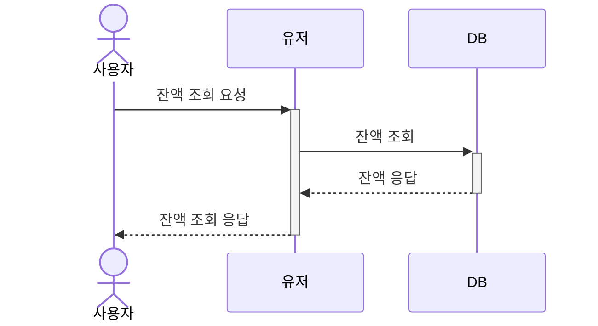
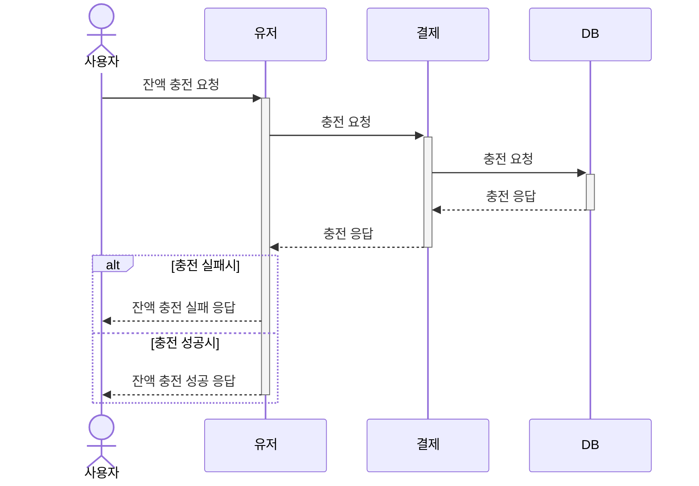
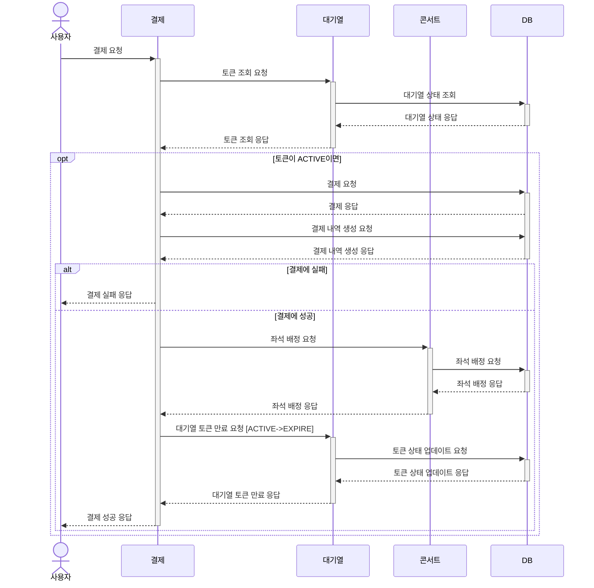

1. 마일스톤 작성
   <https://github.com/users/BattleLoyal/projects/1>

2. 시퀀스 다이어그램

+ 토큰 발급, 토큰 조회, 토큰 폴링

```mermaid
sequenceDiagram
  actor 사용자 as 사용자
  participant 대기열 as 대기열
  participant DB as DB
  participant 스케줄러

  사용자 ->>+ 대기열: 토큰 요청
  대기열 ->>+ DB: 대기열 등록 요청(NONE->WAIT)
  DB -->>- 대기열: 대기열 등록 완료
  대기열 -->>- 사용자: 대기열 정보 응답

loop 특정 시간마다 스케줄링
    스케줄러 ->> DB: 대기열 n개 ACTIVE 및 만료시간 설정
end

loop 특정 시간마다 스케줄링
    스케줄러 ->> DB: 만료된 ACTIVE -> EXPIRE 상태 변경
end

loop 특정 시간마다 폴링 요청
    사용자 ->>+ 대기열: 토큰 조회 요청
    대기열 ->>+ DB: 대기열 상태 조회 요청
    DB -->>- 대기열: 대기열 상태 조회 완료
    대기열 -->>- 사용자: 토큰 정보 응답 [대기 번호 및 상태]
end

```

+ 예약 가능 날짜 조회

```mermaid
sequenceDiagram
  actor 사용자
  participant 대기열
  participant 콘서트
  participant DB

  사용자 ->>+ 콘서트: 예약 가능한 날짜 요청
  콘서트 ->>- 대기열: 토큰 조회 요청
  대기열 ->>+ DB: 대기열 상태 조회
  DB -->>- 대기열: 대기열 상태 응답
  대기열 -->>+ 콘서트: 토큰 조회 응답
  alt 상태가 ACTIVE가 아니면
			콘서트 -->> 사용자: 조회 실패 응답
  else 상태가 ACTIVE이면
      콘서트 ->>+ DB: 예약 가능한 날짜 요청
      DB -->>- 콘서트: 예약 가능한 날짜 응답
      콘서트 -->>- 사용자: 예약 가능한 날짜 응답
  end

```

+ 예약 가능한 좌석 조회

```mermaid
sequenceDiagram
  actor 사용자
  participant 대기열
  participant 콘서트
  participant DB

  사용자 ->>+ 콘서트: 예약 가능한 좌석 요청
  콘서트 ->>- 대기열: 토큰 조회 요청
  대기열 ->>+ DB: 대기열 상태 조회
  DB -->>- 대기열: 대기열 상태 응답
  대기열 -->>+ 콘서트: 토큰 조회 응답
  alt 상태가 ACTIVE가 아니면
			콘서트 -->> 사용자: 조회 실패 응답
  else 상태가 ACTIVE이면
      콘서트 ->>+ DB: 예약 가능한 좌석 요청
      DB -->>- 콘서트: 예약 가능한 좌석 응답
      콘서트 -->>- 사용자: 예약 가능한 좌석 응답
  end
```

+ 좌석 예약 요청

```mermaid
sequenceDiagram
  actor 사용자
  participant 대기열
  participant 콘서트
  participant DB

  사용자 ->>+ 콘서트: 좌석 예약 요청
  콘서트 ->>- 대기열: 토큰 조회 요청
  대기열 ->>+ DB: 대기열 상태 조회
  DB -->>- 대기열: 대기열 상태 응답
  대기열 -->>+ 콘서트: 토큰 조회 응답
  alt 상태가 ACTIVE가 아니면
      콘서트 -->>+ 사용자: 좌석 예약 실패 응답
  else 상태가 ACTIVE이면
  	  콘서트 ->>+ DB: n분간 좌석 임시 배정
      DB -->>- 콘서트: 좌석 배정 응답
	  alt 좌석 예약 실패하면
	    콘서트 -->> 사용자: 좌석 예약 실패 응답
	  else 좌석 예약 성공하면
      콘서트 -->>- 사용자: 좌석 예약 성공 응답
	  end
  end
```

+ 잔액 조회 요청

```mermaid
sequenceDiagram
  actor 사용자
  participant 유저
  participant DB

  사용자 ->>+ 유저: 잔액 조회 요청
  유저 ->>+ DB: 잔액 조회
  DB -->>- 유저: 잔액 응답
  유저 -->>- 사용자: 잔액 조회 응답
```

+ 잔액 충전 요청

```mermaid
sequenceDiagram
  actor 사용자
  participant 유저
  participant 결제
  participant DB

  사용자 ->>+ 유저: 잔액 충전 요청
  유저->>+ 결제: 충전 요청
  결제 ->>+ DB: 충전 요청
  DB -->>- 결제: 충전 응답
  결제 -->>- 유저: 충전 응답
  alt 충전 실패시
    유저 -->> 사용자: 잔액 충전 실패 응답
  else 충전 성공시
	  유저 -->>- 사용자: 잔액 충전 성공 응답
  end
  
```

+ 결제

```mermaid
sequenceDiagram
  actor 사용자
  participant 결제
  participant 대기열
  participant 콘서트
  participant DB

  사용자 ->>+ 결제: 결제 요청
  결제 ->>+ 대기열: 토큰 조회 요청
  대기열 ->>+ DB: 대기열 상태 조회
  DB -->>- 대기열: 대기열 상태 응답
  대기열 -->>- 결제: 토큰 조회 응답
  opt 토큰이 ACTIVE이면
      결제 ->>+ DB: 결제 요청
      DB -->> 결제: 결제 응답
      결제 ->> DB: 결제 내역 생성 요청
      DB -->>- 결제: 결제 내역 생성 응답
      alt 결제에 실패
		    결제 -->> 사용자: 결제 실패 응답
		  else 결제에 성공
		  	결제 ->>+ 콘서트: 좌석 배정 요청
	      콘서트 ->>+ DB: 좌석 배정 요청
	      DB -->>- 콘서트: 좌석 배정 응답
	      콘서트 -->>- 결제: 좌석 배정 응답
	      결제 ->>+ 대기열: 대기열 토큰 만료 요청 [ACTIVE->EXPIRE]
	      대기열 ->>+ DB: 토큰 상태 업데이트 요청
	      DB -->>- 대기열: 토큰 상태 업데이트 응답
	      대기열 -->>- 결제: 대기열 토큰 만료 응답
	      결제 -->>- 사용자: 결제 성공 응답
      end
  end
```
